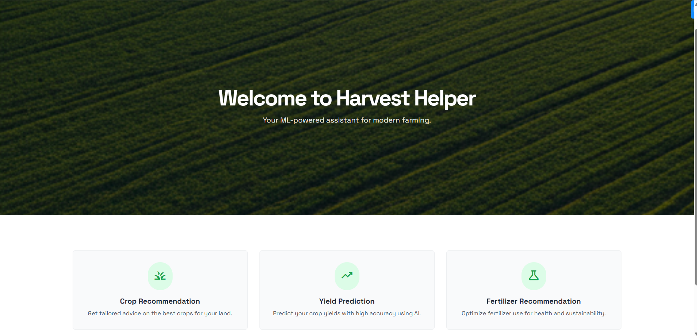

# Harvest Helper: An ML-Powered Agricultural Assistant



Harvest Helper is a comprehensive, ML-powered web application designed to assist farmers, agronomists, and agricultural enthusiasts in making data-driven decisions. By leveraging machine learning, this application provides actionable recommendations for crop selection, yield prediction, and fertilizer usage to optimize farming practices.

The entire application is built with a user-centric design, ensuring that complex data models are accessible through a simple, clean, and responsive interface.

---

## ✨ Features

The application is divided into three core predictive modules, along with robust data management and model evaluation features:

1.  **🌿 Crop Recommendation:**
    *   Recommends the most suitable crop to plant based on soil composition (Nitrogen, Phosphorous, Potassium levels) and environmental factors (Temperature, Humidity, pH, Rainfall).
    *   **Model:** `RandomForestClassifier` trained on a comprehensive crop dataset.

2.  **🌾 Yield Prediction:**
    *   Predicts the potential crop production (in tonnes) based on location (State, District), area (in hectares), season, crop type, rainfall, and soil type.
    *   **Model:** `RandomForestRegressor` trained on historical production data from across India.
    *   **Dynamic UI:** Features cascading dropdowns where selecting a state dynamically populates the available districts.

3.  **🔬 Fertilizer Recommendation:**
    *   Suggests the optimal fertilizer type based on soil health metrics and the specific crop being grown.
    *   **Model:** `RandomForestClassifier` with SMOTE for handling class imbalance, trained on a detailed fertilizer dataset.

4.  **📈 Model Details & Training:**
    *   A dedicated page that displays detailed performance metrics for each of the three models, including Accuracy, R² Score, Classification Reports, and the best hyperparameters found during tuning.
    *   Includes a **"Train All Models"** button that allows the user to trigger hyperparameter tuning (`GridSearchCV`) and retraining of all models directly from the UI.

5.  **📜 Prediction History:**
    *   Automatically logs every successful prediction (inputs and outputs) to a local SQLite database.
    *   A history page with a clean, tabbed interface allows users to review past recommendations.
    *   Functionality to **delete individual entries** or **clear all history** for a specific category.

---

## 🛠️ Technology Stack

*   **Backend:** Python, Flask
*   **Machine Learning:** Scikit-learn, Imblearn, Pandas, NumPy
*   **Frontend:** HTML, Tailwind CSS, JavaScript
*   **Database:** SQLite (built-in with Python)
*   **Data Handling/Serialization:** Pickle, JSON

---

## 💾 Datasets Used

This project utilizes three distinct datasets sourced from Kaggle. You must download them and place them in the `/data` directory as named below.

1.  **Crop Recommendation Dataset**
    *   **File Name:** `Crop_recommendation.csv`
    *   **Description:** Contains soil health metrics (N, P, K, pH) and atmospheric conditions (temperature, humidity, rainfall) for various crops. Used for the Crop Recommendation model.
    *   **Download Link:** [Kaggle: Crop Recommendation Dataset](https://www.kaggle.com/datasets/atharvaingle/crop-recommendation-dataset)

2.  **Crop Production in India Dataset**
    *   **File Name:** `crop_production.csv`
    *   **Description:** A comprehensive dataset of historical crop production data across various states and districts in India. Used for the Yield Prediction model.
    * **Download Link:** [Kaggle: Crop Production in India](https://www.kaggle.com/datasets/darshanroy03/crop-yield-pred)

3.  **Fertilizer Prediction Dataset**
    *   **File Name:** `Fertilizer Prediction.csv`
    *   **Description:** A dataset linking soil characteristics (moisture, N, P, K), crop types, and soil types to specific fertilizer names. Used for the Fertilizer Recommendation model.
    *   **Download Link:** [Kaggle: Fertilizer Prediction Dataset](https://www.kaggle.com/datasets/gdabhishek/fertilizer-prediction-dataset)

---

## 🚀 Getting Started: Setup and Installation

Follow these instructions to get a local copy of the project up and running on your machine.

### Prerequisites

*   Python 3.7+
*   `pip` (Python package installer)

### Installation Steps

<!-- 1.  **Clone the Repository:**
    Open your terminal and clone the project repository to your local machine.
    ```bash
    git clone https://github.com/your-username/harvest-helper.git
    cd harvest-helper
    ``` -->

2.  **Create a Virtual Environment (Recommended):**
    It's a best practice to create a virtual environment to manage project dependencies.
    ```bash
    # For Windows
    python -m venv venv
    venv\Scripts\activate

    # For macOS/Linux
    python3 -m venv venv
    source venv/bin/activate
    ```

3.  **Install Dependencies:**
    Install all the required Python libraries using the `requirements.txt` file.
    ```bash
    pip install -r requirements.txt
    ```

4.  **Download and Place Datasets:**
    Download the three CSV files from the links in the **Datasets Used** section and place them inside the `/data` directory.

5.  **Generate Augmented Data:**
    The yield prediction model uses an augmented version of the production data. Run the provided script to create it.
    ```bash
    python augment_data.py
    ```
    This will create `crop_production_augmented.csv` inside the `/data` folder.

---

## ▶️ Running the Application

After installation, follow these steps to train the models and launch the web server.

### Step 1: Train the Machine Learning Models

Before running the app for the first time, you need to train the models. The application provides scripts to perform hyperparameter tuning and save the best models.

Run each training script from your terminal in the project's root directory. **This may take several minutes**, especially the first time.

```bash
# Train the Crop Recommendation model
python training_pipeline.py

# Train the Yield Prediction model
python yield_training_pipeline.py

# Train the Fertilizer Recommendation model
python fertilizer_training_pipeline.py
```

After this step is complete, you will find several `.pkl` files and a `model_performance.json` file inside the `/models` directory.

### Step 2: Launch the Flask Application

Run the `app.py` file to start the Flask web server.

```bash
python app.py
```

You will see output in your terminal indicating that the server is running, typically on `http://127.0.0.1:5000/`.

### Step 3: Access the Application

Open your favorite web browser and navigate to:
[**http://12.0.0.1:5000/**](http://127.0.0.1:5000/)

You can now use the application! Navigate between the Dashboard, Crop, Yield, Fertilizer, History, and Model Details pages.

---

## 📁 Project Structure

```
/Harvest-Helper
|
|-- data/                  # Datasets
|-- models/                # Trained models, encoders, and performance logs
|-- static/                # CSS, images, and other static files
|-- templates/             # HTML files for the frontend
|
|-- app.py                 # Main Flask application file
|-- database.py            # SQLite database setup and functions
|
|-- training_pipeline.py       # Training script for Crop Recommendation
|-- yield_training_pipeline.py   # Training script for Yield Prediction
|-- fertilizer_training_pipeline.py # Training script for Fertilizer Rec.
|
|-- prediction_pipeline.py     # Prediction logic for Crop Recommendation
|-- yield_prediction_pipeline.py # Prediction logic for Yield Prediction
|-- fertilizer_prediction_pipeline.py # Prediction logic for Fertilizer Rec.
|
|-- augment_data.py        # Script to add features to the yield dataset
|-- requirements.txt       # Project dependencies
|-- README.md              # This file
```